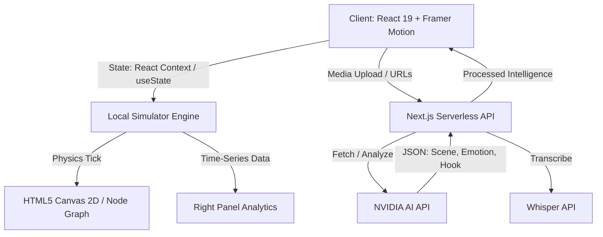

# 🏗️ SOCIAL WORLD SIMULATOR — System Architecture

Welcome to the **Social World Simulator** architecture documentation. This document is written for hackathon judges and developers to understand the technical depth, design patterns, and engineering decisions behind the platform.

---

## 1. System Overview

The application is a **Client-Side Heavy SPA** (Single Page Application) built on Next.js 16 (App Router) and React 19. It leverages the browser's GPU for rendering complex force-directed node graphs while offloading heavy Natural Language Processing (NLP) and Video Intelligence to backend serverless API routes that interface with NVIDIA AI.

### High-Level Architecture Diagram

---

## 2. Core Modules

### 2.1 The Physics Engine (`SocialWorldCanvas.tsx`)
The centerpiece of the application is the living social graph. Rather than using heavy WebGL libraries like Three.js for a simple 2D graph, we opted for an optimized **HTML5 Canvas 2D API** driven by a custom physics loop.

- **Force-Directed Graphing**: Nodes pull toward their designated community centers (Tech Founders, Gen Z, B2B VPs) using a custom spring-physics implementation.
- **Render Loop**: We use `requestAnimationFrame` to paint at 60fps.
- **State Separation**: To avoid React reconciliation bottlenecks, the Canvas maintains its own internal mutable state for node `x`/`y` positions and velocity, while React only dictates the *targets* and *macroscopic events* (like a viral cascade).

### 2.2 The Video Intelligence API (`/api/simulate/route.ts`)
When a user inputs content, the backend route takes over to prevent exposing API keys.
1. **Payload Parsing**: The API receives the raw script, video metadata, or a social media URL.
2. **NVIDIA Inference**: It constructs a highly specific, strict system prompt demanding a structured JSON response.
3. **Strict Content Critic**: The AI is instructed to act as a harsh editor, extracting exact substring quotes of "weak" content and returning them alongside optimized rewrites.
4. **Deterministic Merging**: The returned JSON is passed back to the client and merged directly into the `ContentInput` state, powering the UI highlights and auto-rewrites.

### 2.3 The Simulator Engine (`simulatorEngine.ts`)
This is the deterministic "brain" of the client. Given a specific `ContentInput` (with or without AI fixes applied), it deterministically generates the simulated reality.
- **Node Generation**: Generates 200+ nodes, assigning them to clusters based on the content's `targetAudience` fit.
- **Retention Curve Math**: Uses Bezier-curve approximations to generate realistic drop-off charts based on the `Attention Score`. If AI fixes are applied, the math shifts the curve upwards.
- **Comment Synthesis**: Generates time-stamped mock comments tied to the specific content's vibe.

---

## 3. State Management Strategy

Because the application is highly interactive, state management is strictly isolated:
- **Global / App State**: Managed in `page.tsx` (`simData`, `content`, `currentTime`).
- **Transient UI State**: Accordion toggles, drawer open/close states are kept local to their components (`LeftPanel.tsx`, `RightPanel.tsx`).
- **History Storage**: LocalStorage is used as an ephemeral, zero-setup database to store "Saved Projects" via `historyStore.ts`. This allows users to retain their simulation runs across page refreshes without needing a Postgres database for the MVP.

---

## 4. UI / UX Design Engineering

We strictly followed a **Glassmorphism & Dark Mode** design system:
- **Tailwind v4**: Utilized the new arbitrary values and alpha compositing (`bg-zinc-950/80`, `border-white/[0.06]`).
- **Framer Motion**: Used heavily for the `<AnimatePresence>` accordions in the Left and Right panels, as well as the sliding History drawer and Auth Modal.
- **Accessibility**: Semantic HTML and keyboard-navigable focus states are maintained.

---

## 5. Future Roadmap (Post-Hackathon)
1. **WebSockets**: Migrate the Node Canvas to receive real-time streaming pulses from a backend socket server.
2. **Postgres & Prisma**: Move from LocalStorage to a persistent database for enterprise teams to share simulation results.
3. **WebGPU**: Transition the HTML5 Canvas to WebGPU to support 100,000+ nodes simultaneously for massive viral simulations.
